# SDLC Process: AI-Powered Development Workflow

This document describes the **Software Development Lifecycle (SDLC) process** used to build this project, powered entirely by AI agents and interactive tools.

---

## Overview

This project demonstrates a **modern AI-native development workflow** where:
- 🤖 **GitHub Copilot** handles incremental coding tasks (Claude Sonnet 4.5 for design, Claude Haiku 4.5 for implementation)
- 📋 **Copilot Instructions** maintain architectural alignment across the codebase
- ✅ **Status tracking** in instructions keeps teams synchronized
- 🔄 **Iterative refinement** improves quality after each phase
- 📚 **Living documentation** evolves with the codebase

**Key Principle:** UI-driven development using conversational agents and collaborative tools, eliminating context switching between separate tools.

---

## Phase 1: Discovery & Learning (ChatGPT)

**Duration:** Initial exploration  
**Tools:** ChatGPT (OpenAI)  
**Objective:** Understand requirements, explore patterns, gather domain knowledge

**Process:**
1. **Problem Definition**: Started with a simple recipe recommendation idea
2. **Architecture Exploration**: Researched agentic frameworks and orchestration patterns
3. **Framework Evaluation**:
   - Initially considered PydanticAI (lightweight, focused)
   - Discovered Agno AI during research (superior capabilities)
4. **Technology Selection**: Justified choice of Agno AI:
   - ✅ Multi-modal capabilities (image detection from ingredients)
   - ✅ Out-of-the-box features (memory, databases, retries, tool calling, structured outputs)
   - ✅ AgentOS platform eliminates UI building (no custom frontend needed)
   - ✅ Built-in observability and tracing
5. **Learning Outcomes**: Created comprehensive seed conversation summarizing:
   - Framework choice and reasoning
   - Architectural patterns for agentic systems
   - Learning goals (why demonstrate over-engineering for simple domain)

**Output:** Seed conversation summary + framework selection rationale

---

## Phase 2: Repository Setup & Agent Configuration

**Duration:** Initial setup  
**Tools:** GitHub, GitHub Copilot instructions  
**Objective:** Create repository structure and configure AI agent for consistent development

**Process:**
1. **Create Repository**: Initialize `/home/javi_rnr/poc/challenge/` with basic structure
2. **Generate Copilot Instructions**: Based on seed conversation:
   - Embedded PRD summary into `.github/copilot-instructions.md`
   - Defined coding standards (async/await, type hints, logging)
   - Established commit conventions
   - Created status tracking section for task completion
3. **Instruction Evolution**: These instructions were **continuously updated**:
   - After each phase (Requirements → Design → Implementation)
   - After discovering new patterns or constraints
   - To reflect latest decisions and learnings
   - Kept as the source of truth for agent context

**Output:** Repository structure + `.github/copilot-instructions.md` (first version)

---

## Phase 3: Requirements & Design (GitHub Copilot + Claude)

**Duration:** Iterative refinement cycles  
**Tools:** GitHub Copilot (Claude Sonnet 4.5 for design, Claude Haiku for coding)  
**Objective:** Define detailed requirements, architecture, and implementation roadmap

**Process:**

### 3.1 Product Requirements Document (PRD)

**Initial Creation:**
- Translated seed conversation into formal PRD structure
- Included functional requirements, constraints, data models
- Documented design goals and system overview

**Iterative Refinement:**
- **Round 1**: "Clarify learning goals"
- **Round 2**: "Emphasize intentional over-engineering for educational value"
- **Round 3**: "Add demonstrated capabilities & patterns section"
- Used Claude Sonnet 4.5 for clear, comprehensive writing
- Consolidated feedback from multiple review cycles

**Final PRD Elements:**
- Purpose: Learning & demonstration project
- Demonstrated capabilities (memory, knowledge base, tools, tracing, testing)
- Intentional complexity justification
- Functional requirements for each major capability

### 3.2 Design Document (DESIGN.md)

**Creation Process:**
- Built on PRD foundation with deeper technical detail
- Included architecture diagrams and trade-off analysis
- Documented design decisions with reasoning

**Refinement Cycles:**
- **Round 1**: Added async/await architecture section
- **Round 2**: Created comparison table (Simple vs. Production vs. Learning Value)
- **Round 3**: Justified over-engineering with specific learning outcomes
- **Round 4**: Detailed MCP initialization pattern and external tools

**Key Sections Added:**
- Design goals and non-goals
- Async/await implementation standards (critical for non-blocking I/O)
- Tool patterns (internal @tool vs. external MCP)
- Knowledge base architecture
- Session memory and persistence strategy

### 3.3 Implementation Plan (IMPLEMENTATION_PLAN.md)

**Design Approach:**
- Created **independent, self-contained tasks** (no blocking dependencies)
- Each task specified:
  - Clear objective and context
  - Detailed input/output requirements
  - Success criteria (testable, measurable)
  - Constraints and key decisions
- Organized into logical groups (Infrastructure → Core Features → Testing)

**Specification Examples:**
- Task 1: Project structure and dependencies
- Task 2: Configuration management
- Task 2.5: Logging infrastructure
- Task 3: Pydantic data models
- Tasks 4-5: Unit tests
- Task 6+: Core features and testing

**Documentation Quality:**
- Included code examples and patterns
- Specified validation rules with Field constraints (Pydantic v2)
- Provided success criteria for verification
- Linked dependencies clearly

---

## Phase 4: Implementation (GitHub Copilot Coding Agent)

**Duration:** Incremental task completion  
**Tools:** GitHub Copilot (Claude Haiku 4.5 for coding efficiency)  
**Objective:** Build working application from specifications

**Process:**

### 4.1 Incremental Task Execution

**Workflow per Task:**
1. **Read Task Specification**: From IMPLEMENTATION_PLAN.md
2. **Implement Code**: GitHub Copilot generates implementation
3. **Verify & Refine**: Check against success criteria
4. **Write Tests**: Add unit tests for new code
5. **Update Instructions**: Mark task complete in copilot-instructions.md
6. **Commit**: `git commit -m "Task [N]: description"`
7. **Push**: `git push origin main`

**Example Task Sequence:**
- Task 1 ✅: Project structure created
- Task 2 ✅: Config.py implemented with env var loading
- Task 2.5 ✅: Logging infrastructure with JSON/text formatters
- Task 3 ✅: Pydantic models with Field constraints (141 lines, comprehensive validation)
- Task 4 ✅: Unit tests for models (65+ test cases)
- Task 5 ✅: Unit tests for config (40+ test cases)

### 4.2 Status Tracking in Instructions

**Copilot Instructions** (`copilot-instructions.md`) maintained:
- **Current status section** updated after each task
- **Completed tasks marked** with date and brief summary
- **In-progress task** identified (max one at a time)
- **Pending tasks** listed with dependencies

**Example Status Entry:**
```
✅ Task 6 complete (date: 2026-01-19) - Ingredient detection core
- Async image fetching with aiohttp
- Gemini vision API integration
- Confidence filtering
- 120 test cases passing
```

### 4.3 Code Commit Discipline

**Commit Convention:**
```bash
git commit -m "Task [N]: Brief description of changes"
```

**Example Commits:**
- `Task 1: Project structure, dependencies, .gitignore`
- `Task 2: Configuration management with env var loading`
- `Task 3: Pydantic models with Field constraints`
- `Task 8: Spoonacular MCP initialization with retry logic`
- `Task 10: AgentOS application setup and AGUI`

**Rationale:**
- Clear, atomic commits per task
- Easy to revert if needed
- Traceable history of implementation decisions
- Enables bisecting for bug investigation

---

## Phase 5: Testing & Refinement (Iterative)

**Duration:** Ongoing quality improvements  
**Tools:** GitHub Copilot, test frameworks (pytest, Agno Evals)  
**Objective:** Validate implementation, improve coverage, add features

**Process:**

### 5.1 Unit Testing

**Coverage Areas:**
- Models validation (Pydantic constraints, field validation)
- Configuration loading (env vars, defaults, validation)
- Logging infrastructure (JSON/text formatters, levels)
- MCP initialization (retry logic, connection validation)
- Ingredient detection (async image fetching, confidence filtering)

**Test Execution:** `make test`  
**Result:** 140+ unit tests passing (fast, isolated, no external calls)

### 5.2 Integration Testing

**Agno Evals Framework:**
- AccuracyEval: Ingredient detection accuracy (LLM-as-judge with Gemini)
- AgentAsJudgeEval: Recipe quality, preference persistence, guardrails, session isolation
- ReliabilityEval: Correct tool sequencing (search → get_information_bulk)
- PerformanceEval: Response time under 5 seconds

**Test Execution:** `make eval`  
**Result:** 8 comprehensive integration tests, evaluations persisted to database

### 5.3 REST API Testing

**Endpoint Coverage:**
- Basic chat requests and session management
- Image upload handling and validation
- Error cases and edge conditions
- Preference persistence across requests
- Session isolation and data privacy

**Test Execution:** `make int-tests`  
**Result:** 13 endpoint tests with httpx async HTTP client

### 5.4 Refinement Cycles

**Typical Refinement Loop:**
1. **Run Tests**: Execute `make test && make eval`
2. **Identify Issues**: Review failures, gaps, or performance issues
3. **Implement Fix**: Update code or add features
4. **Add Tests**: Ensure new scenarios covered
5. **Update Status**: Mark in copilot-instructions.md
6. **Commit & Push**: `git add -A && git commit -m "Refactor/feature: description"`

**Example Refinements:**
- **Async Architecture Refactor** (2026-01-19): Replaced blocking calls with async/await throughout
- **Memory System Refactor** (2026-01-19): Implemented minimal input schema + Agno user memory for preferences
- **Architecture Cleanup** (2026-01-19): Removed custom hooks, focused on LLM response generation
- **Documentation De-duplication** (2026-01-22): Removed redundant sections, consolidated Agno OS setup instructions

---

## Phase 6: Documentation Evolution

**Duration:** Continuous updates  
**Tools:** GitHub Copilot, markdown editors  
**Objective:** Keep documentation accurate and aligned with implementation

**Process:**

### 6.1 README.md (Final State)

**Purpose:** User-facing documentation  
**Content:**
- Project overview and learning goals
- Quick start (make setup && make dev)
- Architecture and API reference
- Testing instructions
- Troubleshooting

---

## Key AI-Native Patterns

### Pattern 1: Copilot Instructions as Source of Truth

**Concept:** Rather than manual wikis or tracking documents, instructions evolve with the project.

**Benefits:**
- ✅ Single source of truth (always in sync with code)
- ✅ Agent context remains accurate (regenerated each session)
- ✅ Status visible at code review time
- ✅ No separate tracking tools needed

**Implementation:**
```
.github/copilot-instructions.md
├── Purpose & Vision
├── Status Section (updated after each task)
├── Architecture Overview
├── Implementation Guidelines
├── Testing Strategy
└── Do's & Don'ts
```

### Pattern 2: Conversational Refinement (UI-Driven)

**Concept:** All changes made through conversation, maintaining natural flow.

**Process:**
1. User: "Clarify learning goals and emphasis"
2. AI: Understands context, proposes specific changes
3. User: Approves changes through UI
4. AI: Applies edits, confirms completion
5. User: Reviews, optionally refines further

**Benefit:** No manual diff viewing or manual edits needed.

### Pattern 3: Incremental Specification Design

**Concept:** Instead of monolithic requirement, break into independent tasks.

**Structure:**
```
Task 1 (Project Setup)
  ├─ No dependencies
  ├─ ~2 hours for human
  └─ 10 minutes for GitHub Copilot

Task 2 (Configuration)
  ├─ Depends on Task 1 (optional)
  ├─ ~1 hour for human
  └─ 5 minutes for GitHub Copilot

Task 3+ (Core Features)
  ├─ Independent of each other
  └─ Parallelizable if needed
```

**Benefit:** Tasks can be assigned to different agents or humans without coordination overhead.

### Pattern 4: Status Tracking in Code

**Concept:** Don't create separate tracking documents; use source files.

**Implementation:**
- Copilot instructions contain "Status Section"
- Marked with completion date, test results
- Example: `✅ Task 6 complete (date: 2026-01-19) - Ingredient detection core`

**Benefit:** Single source of truth, version controlled, reviewable.

---

## Lessons Learned

### Framework Selection
- **PydanticAI → Agno AI**: PydanticAI is lightweight but specialized. Agno AI's comprehensive features (memory, multimodal, AgentOS) justified the switch even for simple problems—ideal for demonstrating enterprise patterns.

### Documentation Quality
- **Early & Continuous**: Best documentation results from multiple refinement cycles early on, not one final pass at the end.
- **Different Docs for Different Purposes**: PRD (requirements), DESIGN (architecture), IMPLEMENTATION_PLAN (tasks), README (users), copilot-instructions.md (developers).

### AI-Driven Development
- **Specification Precision Matters**: Detailed task specifications (success criteria, constraints, examples) lead to better implementation quality.
- **Status Visibility**: Keeping status in code (copilot-instructions.md) provides continuous alignment without overhead.
- **Commit Discipline**: Atomic commits per task create clean history and enable code review.

### Testing Strategy
- **Test-Driven Refinement**: Writing tests early (unit → integration → evaluation) catches issues before they compound.
- **Async Everywhere**: Async/await discipline is non-negotiable in production systems; better enforced early than retrofitted.

---

## Workflow Summary

```mermaid
graph TD
    A["Phase 1: Discovery<br/>(ChatGPT)"] -->|Seed Conversation| B["Phase 2: Setup<br/>(Repository + Instructions)"]
    B -->|Framework Decision| C["Phase 3: Design<br/>(PRD → DESIGN → PLAN)"]
    C -->|Specifications| D["Phase 4: Implementation<br/>(Task-by-task)"]
    D -->|Code + Tests| E["Phase 5: Refinement<br/>(Test & iterate)"]
    E -->|Improvements| F["Phase 6: Documentation<br/>(Align & finalize)"]
    F -.->|Continuous| D
    F -->|Complete| G["Production Ready"]
```



**Key Transitions:**
- Discovery → Setup: Seed conversation informs repository structure
- Setup → Design: Framework choice and learning goals inform architecture
- Design → Implementation: Detailed specifications enable task-based coding
- Implementation → Refinement: Tests identify gaps, guide improvements
- Refinement → Documentation: Final state documented as reference

---

## Conclusion

This project demonstrates a **modern AI-native SDLC** that:
- ✅ Uses conversational UI for all phases (discovery to deployment)
- ✅ Maintains architectural alignment through living instructions
- ✅ Breaks work into independent, parallelizable tasks
- ✅ Enforces quality through incremental testing
- ✅ Keeps documentation concise and version-controlled
- ✅ Produces production-ready code with comprehensive patterns

The workflow is **repeatable and scalable** to larger projects while maintaining clarity and team synchronization.
