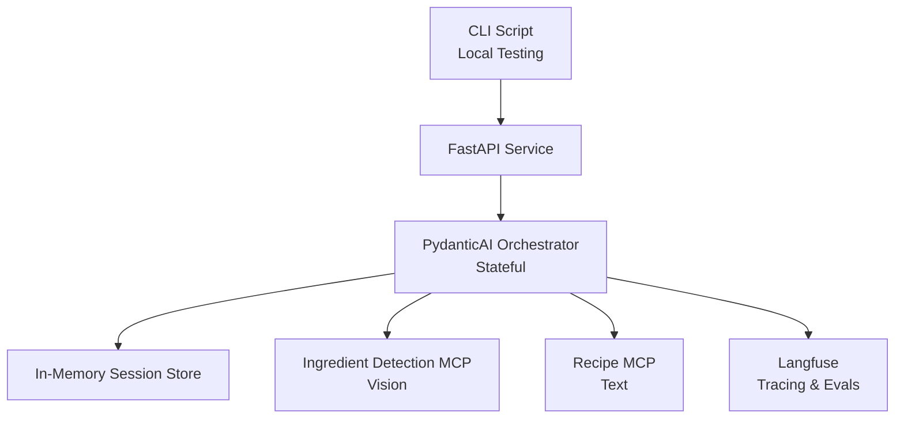
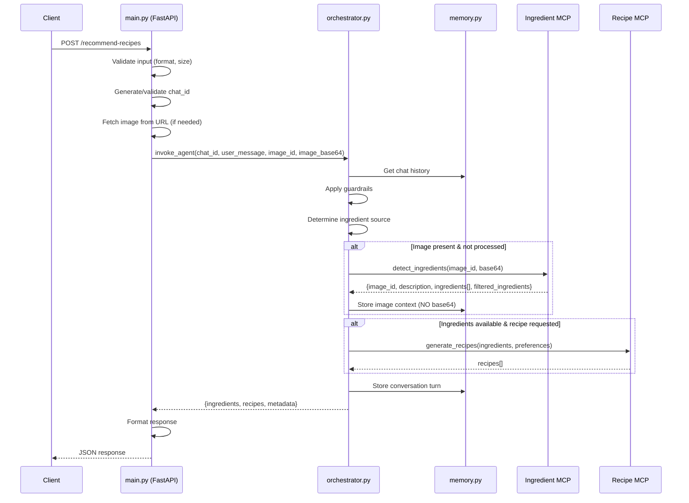
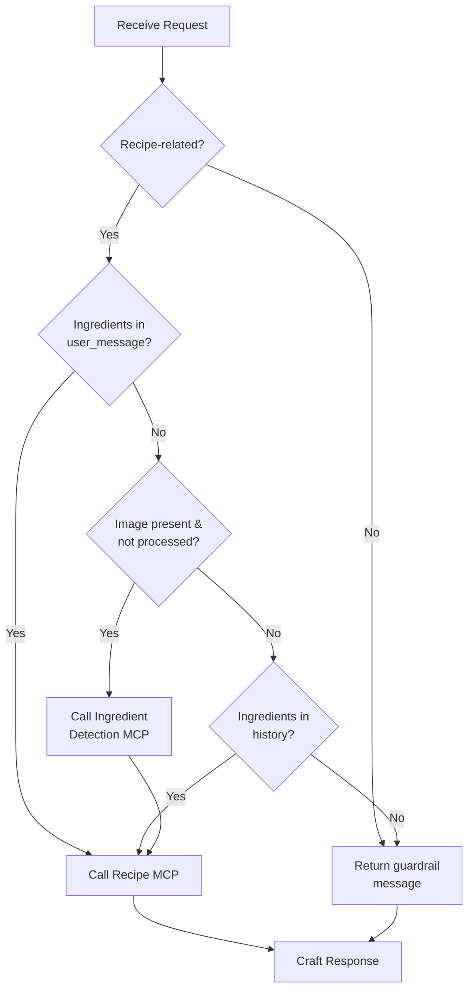

# Solution Design Document  
**Image-Based Recipe Recommendation Service (GenAI, MCP-based)**

---

## 1. Purpose of This Document

This document provides a **detailed solution design** for the Image-Based Recipe Recommendation Service described in the PRD.

Its primary goals are to:
- Guide a **coding agent inside an IDE** step-by-step
- Make **intent, constraints, and trade-offs explicit**
- Clarify *why* certain design decisions were made
- Reduce ambiguity during implementation
- Enable maintainable, production-quality code

This document intentionally goes beyond “what” and explains **“why” and “how”**, while still avoiding full code listings.

---

## 2. Design Goals & Non-Goals

### 2.1 Design Goals

- Demonstrate **real-world GenAI system design**
- Showcase **tool-based orchestration with MCP**
- Use **structured outputs everywhere**
- Make reasoning and grounding visible
- Keep the system **simple, explicit, and reviewable**
- Optimize for **clarity over cleverness**

### 2.2 Non-Goals

- Maximum performance or scale
- UI polish
- Persistent storage
- Feature completeness (e.g., nutrition, shopping lists)

---

## 3. Key Design Decisions (Rationale)

This section explains the most important architectural choices.

### 3.1 Why PydanticAI as the Orchestrator

- Enforces **structured outputs**
- Makes retries and validation first-class
- Encourages deterministic LLM usage
- Fits well with MCP and tool calling
- Easier to reason about than raw SDK calls

**Trade-off:**  
Less flexibility than raw prompts, but significantly safer and clearer.

---

### 3.2 Why MCP for Tools

- Explicit contracts between orchestrator and tools
- Enables independent evolution of components
- Mirrors real-world agent/tool architectures
- Makes tool usage auditable and testable

**Trade-off:**  
Slightly more setup complexity, but much better separation of concerns.

---

### 3.3 Why a Stateful Orchestrator but Stateless Tools

- Conversation logic belongs in one place
- Tools should be reusable, simple, and deterministic
- Avoids hidden state and hard-to-debug behavior

---

### 3.4 Why Session-Based In-Memory Memory

- Simple and sufficient for the challenge
- Demonstrates conversational context handling
- Avoids infrastructure complexity

**Memory Design:**
- Base64 image data is NEVER stored (only in request, never persisted)
- Each message stores: user/assistant text, detected ingredients, extracted preferences
- Preferences (diet, cuisine, intolerances, meal type) persist across conversation
- Reduces memory footprint while supporting contextual follow-ups

---

### 3.5 Why Gemini (Configurable)

- Strong multimodal capabilities
- Works cleanly with PydanticAI
- Environment-based configuration demonstrates production readiness

---

## 4. High-Level Architecture

### System Overview Diagram



### Diagram Explanation

- **CLI Script**: Developer convenience tool; not part of core logic
- **FastAPI Service**: Thin HTTP layer; no intelligence
- **Orchestrator**: The brain of the system
- **Memory Store**: Short-lived conversational context
- **Ingredient MCP**: Vision-only responsibility
- **Recipe MCP**: Recipe generation only
- **Langfuse**: Observability, not business logic

---

## 5. Repository & Module Structure

### Folder Structure

```
.
├── app/
│   ├── main.py               # FastAPI application (HTTP entrypoint)
│   ├── orchestrator.py       # PydanticAI agent with decision logic
│   ├── memory.py             # In-memory session storage (dict-based)
│   ├── models.py             # Pydantic schemas (request/response/domain)
│   ├── config.py             # Environment configuration (dotenv + env vars)
│   └── tracing.py            # Langfuse setup (optional)
│
├── mcp/
│   ├── vision.py             # Gemini vision service for ingredient detection
│   └── recipe_client.py       # Spoonacular-MCP client (npx, stdio)
│
├── tests/
│   ├── unit/
│   │   ├── test_models.py
│   │   ├── test_orchestrator.py
│   │   └── test_memory.py
│   └── integration/
│       └── test_e2e.py
│
├── scripts/
│   └── cli.sh                # Bash script for manual testing
│
├── images/
│   └── sample_*.jpg          # Test images
│
├── .env.example              # Template environment file
├── .gitignore                # Excludes .env
├── Makefile
├── requirements.txt
├── README.md
└── .github/
    └── copilot-instructions.md
```

### Module Responsibilities

**app/main.py** (FastAPI Service)
- HTTP request/response handling
- Input validation (image format, size, required fields)
- Image URL fetching and validation
- Image size enforcement (413 error for oversized images)
- Chat ID generation (if not provided)
- Pass validated data to orchestrator
- Format responses and errors (400, 413, 422, 500)

**app/orchestrator.py** (PydanticAI Agent)
- Core decision logic (guardrails, tool selection)
- System prompt with detailed instructions
- Call MCP tools when needed
- Manage chat history via memory.py
- Craft final user responses
- Handle tool call failures gracefully

**app/memory.py** (Session Storage)
- In-memory dict: `{chat_id: ChatSession}`
- Store conversation messages with attached metadata
  - Detected ingredients per message
  - Extracted preferences (diet, cuisine, intolerances, meal type)
- FIFO eviction when MAX_HISTORY reached
- Retrieve session by chat_id

**app/models.py** (Pydantic Schemas)
- API request/response models with validation
- Domain models (Ingredient, Recipe, ConversationTurn, ChatSession)
- Message metadata with ingredients and preferences
- Error response model
- Vision and Recipe MCP tool schemas

**app/config.py** (Configuration)
- Load .env file using python-dotenv
- Environment variables override .env values
- Provide typed config object with defaults
- Validate required fields (GEMINI_API_KEY, SPOONACULAR_API_KEY)

**app/tracing.py** (Langfuse Integration)
- Initialize Langfuse client (if keys provided)
- Gracefully degrade if not configured (log warning)
- Provide tracing decorators/context managers
- Track orchestrator runs, tool calls, latency

**mcp/vision.py** (Vision Service)
- Local integration with Gemini Vision API
- Ingredient detection from image base64
- Return: ingredients list, description, confidence scores
- Apply MIN_INGREDIENT_CONFIDENCE filtering internally
- Stateless, no memory

**mcp/recipe_client.py** (Spoonacular Recipe Client)
- PydanticAI FastMCP client using stdio transport
- Connect to spoonacular-mcp via npx (no local checkout needed)
- Pass: query (ingredients), diet, cuisine, intolerances, meal type
- Return: recipe recommendations with structured data
- Stateless wrapper around spoonacular-mcp

### Structural Principles

- **app/** contains reusable application code
- **mcp/** contains MCP servers and clients (tools)
- **tests/** split by unit vs integration
- No circular dependencies
- MCP tools fail at app startup if unreachable

---

## 6. API Design (main.py)

### Endpoint Definition

**POST** `/recommend-recipes`

Handles complete request lifecycle from validation to response formatting.

---

### Request Model

```python
class RecommendRecipesRequest(BaseModel):
    chat_id: Optional[str] = None
    user_message: str
    image_url: Optional[HttpUrl] = None
    image_base64: Optional[str] = None
    
    @model_validator(mode='after')
    def validate_input_source(self):
        # At least one of: image_url, image_base64, or ingredients in user_message
        # Image format validation (JPEG/PNG)
        # Base64 decoding validation
        pass
```

**Validation Rules:**
- At least one input source required (image or ingredients in text)
- Image format: JPEG or PNG only
- Image size: <= MAX_IMAGE_SIZE_MB (default 5MB)
- Return 400 for invalid inputs
- Return 413 for oversized images

---

### Response Model

```python
class RecommendRecipesResponse(BaseModel):
    chat_id: str
    ingredients: List[str]  # Simplified ingredient names
    recipes: List[Recipe]
    metadata: ResponseMetadata

class ResponseMetadata(BaseModel):
    tools_called: List[str]
    model_used: str
    response_time_ms: int
    filtered_ingredients: Optional[bool]  # True if low-confidence ingredients were filtered
```

---

### Error Response Model

```python
class ErrorResponse(BaseModel):
    error: str  # Error type: "validation_error", "payload_too_large", "guardrail_triggered", "internal_error"
    message: str  # Human-readable explanation
    chat_id: Optional[str] = None  # Include if available
```

**HTTP Status Codes:**
- 200: Success
- 400: Bad Request (validation failure, invalid format)
- 413: Payload Too Large (image exceeds MAX_IMAGE_SIZE_MB)
- 422: Unprocessable Entity (guardrails triggered, business logic failure)
- 500: Internal Server Error (unexpected failures)

---

## 7. Request Lifecycle & Data Flow

### High-Level Flow



### Detailed Step-by-Step

1. **main.py receives request**
   - Validate JSON schema
   - Check image format (JPEG/PNG)
   - Decode base64 if provided
   - Fetch image from URL if provided
   - Check image size (413 if > MAX_IMAGE_SIZE_MB)
   - Generate chat_id if missing
   - Generate unique image_id if image present

2. **main.py calls orchestrator**
   - Pass: chat_id, user_message, image_id (if image), base64 (if image)
   - Base64 passed ONLY to orchestrator, not stored anywhere

3. **orchestrator.py processes request**
   - Retrieve chat history from memory.py
   - Apply domain guardrails (recipe-related only)
   - Check for ingredients in user_message (priority 1)
   - Check if image present (priority 2)
   - Check chat history for ingredients (priority 3)
   - If no ingredients and no image → return guardrail response (422)

4. **orchestrator calls Ingredient MCP** (conditional)
   - Called ONLY if image present AND not already processed
   - Pass: image_id, base64
   - Receive: image_id, description, ingredients (filtered by MCP), filtered_ingredients flag
   - Store in memory: image_id, description, ingredients - NOT base64

5. **orchestrator calls Recipe MCP** (conditional)
   - Called when ingredients available and recipe requested
   - Pass: ingredient names, user preferences/nuances
   - Receive: recipe recommendations

6. **orchestrator crafts response**
   - Ground in tool outputs
   - Incorporate chat history
   - Include user preferences and context
   - Store conversation turn in memory (FIFO eviction if needed)

7. **main.py formats response**
   - Include metadata (tools_called, model, latency, filtered_ingredients)
   - Return 200 with structured JSON
   - Handle errors with appropriate status codes

---

## 8. Session & Memory Design (memory.py)

### Memory Model

**Storage:** In-memory Python dict
```python
sessions: Dict[str, ChatSession] = {}
```

**ChatSession Structure:**
```python
class ChatSession:
    chat_id: str
    messages: List[ConversationTurn]  # FIFO, max MAX_HISTORY
    processed_images: Dict[str, IngredientDetectionOutput]  # image_id -> metadata
```

**ConversationTurn:**
```python
class ConversationTurn:
    role: str  # "user" or "assistant"
    content: str
    timestamp: datetime
```

### Key Rules

- **Base64 image data is NEVER stored** - only processed metadata
- FIFO eviction: oldest messages removed when MAX_HISTORY exceeded
- Image metadata persists across conversation (not evicted with messages)
- Memory is ephemeral (process restart clears all sessions)

### Operations

- `get_session(chat_id)` - Retrieve or create new session
- `store_turn(chat_id, role, content)` - Add message with FIFO eviction
- `store_image_context(chat_id, image_id, description, ingredients, filtered_ingredients)` - Store ingredient detection output
- `get_ingredients(chat_id)` - Get all ingredients from history

---

## 9. Orchestrator Logic (orchestrator.py)

### PydanticAI Agent Design

The orchestrator is a **PydanticAI agent** with structured outputs and explicit tool calling.

### System Prompt (Detailed Instructions)

The agent's system prompt must include:

```
You are a recipe recommendation assistant. You ONLY answer recipe-related questions.

CORE PRINCIPLES:
- Only respond to recipe-related queries. Politely decline off-topic requests.
- Ground ALL responses in tool outputs. Never invent ingredients or recipes.
- Maintain conversation context and user preferences across turns.
- Be helpful, concise, and friendly.

TOOL USAGE GUIDELINES:

1. INGREDIENT DETECTION MCP (vision service):
   - CALL ONLY when an image is provided in the current user message
   - Use this to extract ingredients from uploaded images
   - Do not call for text-only messages or follow-ups without new images
   - Store extracted ingredients for use in recipe searches

2. RECIPE MCP (spoonacular service):
   - CALL when users ask about recipes (main goal of the system)
   - ALWAYS use TWO-STEP PROCESS:
     a. First call search_recipes to get recipe IDs based on ingredients and preferences
     b. Then call get_recipe_information_bulk with the IDs to get full recipe details
   - Use search_recipes tool with appropriate filters based on user preferences
   - For follow-up questions, you can reference previous recipes but should call the tool again for new ideas
   - You can call multiple times to find better recipes or different options
   - Extract preferences from user messages: diet, cuisine, intolerances, meal type
   - Pass preferences as parameters: diet, cuisine, intolerances, type
   - Always get full recipe details (instructions, ingredients, nutrition) for complete responses

DECISION FLOW:
1. Check if request is recipe-related. If not, politely decline with guardrail message.
2. Determine ingredient source (priority order):
   a. Ingredients explicitly mentioned in user's current message
   b. Image provided in current request (call Ingredient MCP if present)
   c. Ingredients from previous conversation history
3. If NO ingredients available from any source, ask user to provide ingredients or an image.
4. When ingredients are available and user wants recipes, call Recipe MCP with preferences.
5. For follow-ups, preserve previous preferences but allow updates.
6. Always ground responses in tool outputs and reference conversation history naturally.

PREFERENCE EXTRACTION EXAMPLES:
- "Italian vegetarian recipes" → diet="vegetarian", cuisine="italian"
- "Gluten-free dessert ideas" → intolerances="gluten", type="dessert"
- "Quick vegan lunch" → diet="vegan", type="main course"
- "No peanuts please" → intolerances="peanuts"

TOOL CALL PATTERNS:
- New recipe request: Call Recipe MCP with extracted preferences
- Follow-up "more options": Call Recipe MCP again with same/similar preferences
- Preference change: Update preferences and call Recipe MCP
- Image upload: Call Ingredient MCP first, then Recipe MCP if recipes requested
```

### Decision Flow Diagram



### Tool Call Logic

**When to call Ingredient Detection MCP:**
- Image present in request, AND
- Image has not been processed before (check processed_images in memory)
- Pass: image_id, base64 (base64 received from main.py, used only for this call)

**When to call Recipe MCP:**
- Ingredients available (from ANY source), AND
- User is requesting recipe recommendations (not just chatting)
- Pass: ingredient names (strings), user preferences/nuances extracted from message
- Can be called multiple times for follow-ups or to get more recipe ideas
- Use search_recipes tool with parameters: query, diet, cuisine, intolerances, type, number

**When NOT to call tools:**
- Simple acknowledgments ("thanks", "ok")
- Clarification questions
- Off-topic requests (trigger guardrails instead)

### Response Crafting

- Ground ALL recipe information in tool outputs
- Never hallucinate ingredients or recipes
- Incorporate chat history for context
- Reference if ingredients were filtered (use filtered_ingredients flag)
- Mention image descriptions naturally
- Be concise, helpful, friendly

### Error Handling

- Tool call failures: Log error, return user-friendly message
- Schema validation failures: Retry with PydanticAI's built-in retry logic
- Guardrail triggers: Return 422 status with clear explanation

---

## 10. Data Models (models.py)

### Core Domain Models

```python
class Ingredient(BaseModel):
    name: str
    # Note: Confidence scores handled internally by MCP, not exposed in API

class Preferences(BaseModel):
    diet: Optional[str] = None  # Diet type (vegetarian, vegan, gluten-free, etc.)
    intolerances: Optional[str] = None  # Comma-separated intolerances
    meal_type: Optional[str] = None  # Meal type (main course, side dish, dessert, etc.)
    cuisine: Optional[str] = None  # Cuisine type (italian, mexican, chinese, etc.)

### MCP Tool Schemas

```python
# Ingredient Detection MCP (implemented locally)
class IngredientDetectionInput(BaseModel):
    image_id: str
    image_base64: str

class IngredientDetectionOutput(BaseModel):
    image_id: str
    description: str
    ingredients: List[str]  # Already filtered by MIN_INGREDIENT_CONFIDENCE
    filtered_ingredients: bool  # True if any ingredients were filtered out

# Recipe MCP schemas are defined by the spoonacular-mcp package
# Orchestrator uses MCP metadata to call tools with correct parameters
```

### Agent Models

```python
class OrchestratorInput(BaseModel):
    """Input passed from main.py to orchestrator.py for agent invocation"""
    chat_id: str  # Generated/validated chat ID
    user_message: str
    image_id: Optional[str] = None  # Unique image ID if image present
    image_base64: Optional[str] = None  # Base64-encoded image (NOT stored)

class OrchestratorOutput(BaseModel):
    """Output from PydanticAI orchestrator before formatting as API response"""
    chat_id: str
    response: str  # Synthesized natural language response using ingredients and recipes
    ingredients: List[str]  # All detected/provided ingredients
    recipes: List[Recipe]
    metadata: ResponseMetadata
    preferences: Optional[Preferences] = None  # Extracted/updated user preferences
```

### API Models

```python
class RecommendRecipesRequest(BaseModel):
    chat_id: Optional[str] = None
    user_message: str
    image_url: Optional[HttpUrl] = None
    image_base64: Optional[str] = None

class ResponseMetadata(BaseModel):
    tools_called: List[str]  # e.g., ["ingredient_detection", "recipe_generation"]
    model_used: str  # e.g., "gemini-1.5-flash"
    response_time_ms: int
    filtered_ingredients: Optional[bool] = None  # Present only if image processed

class RecommendRecipesResponse(BaseModel):
    chat_id: str
    response: str  # Synthesized natural language response using ingredients and recipes
    ingredients: List[str]  # All detected/provided ingredients
    recipes: List[Recipe]
    metadata: ResponseMetadata
    preferences: Optional[Preferences] = None  # User preferences for this session

class ErrorResponse(BaseModel):
    error: str  # "validation_error", "payload_too_large", "guardrail_triggered", "internal_error"
    message: str
    chat_id: Optional[str] = None
```

### Memory Models

```python
class ConversationTurn(BaseModel):
    role: str  # "user" or "assistant"
    content: str
    timestamp: datetime
    ingredients: List[str] = []  # Detected/discussed ingredients in this turn
    preferences: Optional[Preferences] = None  # Extracted preferences from this turn

class ChatSession(BaseModel):
    chat_id: str
    messages: List[ConversationTurn]  # Max MAX_HISTORY, each with metadata
    preferences: Optional[Preferences] = None  # Aggregated preferences across conversation
```

**ConversationTurn Details:**
- `role`: "user" or "assistant"
- `content`: message text
- `timestamp`: when message was created
- `ingredients`: list of detected/discussed ingredients in this specific turn
- `preferences`: extracted preferences from this turn (diet, cuisine, intolerances, meal_type)

---

## 11. MCP Design & Integration

### 11.1 Vision Service (mcp/vision.py)

**Type:** Local Gemini Vision integration

**Technology:** Gemini Vision API via google-generativeai SDK

**Startup Behavior:**
- Validate GEMINI_API_KEY is configured
- Fail app startup if API key missing or invalid
- Log connection status

**Input:**
- Base64-encoded image (JPEG or PNG)

**Output:**
- ingredients: list of detected ingredient names
- description: generated image description
- confidence_scores: dict mapping ingredient -> confidence (0.0-1.0)

**Internal Logic:**
- Receive base64 image from main.py
- Call Gemini Vision API with structured prompt
- Extract ingredients with confidence scores
- Filter out ingredients below MIN_INGREDIENT_CONFIDENCE internally
- Generate image description
- Return structured output

**Error Handling:**
- Invalid base64: Return 400 error
- Vision API failure: Propagate error to orchestrator
- Missing API key: Fail at startup

---

### 11.2 Recipe Search Client (mcp/recipe_client.py)

**Type:** Spoonacular MCP client via stdio

**Technology:** PydanticAI FastMCP client + spoonacular-mcp (Node.js via npx)

**Setup:**
- No local repository checkout needed
- Run directly from npx: `npx spoonacular-mcp`
- Requires SPOONACULAR_API_KEY environment variable

**Connection:**
```python
from fastmcp.client import FastMCPClient

client = FastMCPClient(
    transport="stdio",
    command="npx",
    args=["-y", "spoonacular-mcp"]
)
```

**Startup Behavior:**
- Application MUST connect at startup
- Fail app startup if connection fails
- Test connection with simple recipe search

**NOTE:** The schemas are for info only, no need to implement anything, just create the client and let the existing `spoonacular-mcp` handle the schemas.

**Input Schema (search_recipes tool - Step 1: Find recipe IDs):**
- `query` (optional): comma-separated ingredients or search term
- `diet` (optional): "vegetarian", "vegan", "gluten-free", etc.
- `intolerances` (optional): comma-separated intolerances (peanuts, dairy, etc.)
- `type` (optional): "main course", "side dish", "dessert", "appetizer", etc.
- `cuisine` (optional): "italian", "mexican", "chinese", "indian", etc.
- `includeIngredients` (optional): comma-separated ingredients that must be used
- `excludeIngredients` (optional): comma-separated ingredients to avoid
- `number` (optional, default 10): number of results (1-100)

**Output Schema (search_recipes):**
```python
{
    "results": [
        {
            "id": int,
            "title": str,
            "image": str,
            "imageType": str
        }
    ],
    "totalResults": int,
    "offset": int
}
```

**Input Schema (get_recipe_information_bulk tool - Step 2: Get full recipe details):**
- `ids` (required): comma-separated recipe IDs from search results
- `includeNutrition` (optional, default false): include nutritional information

**Output Schema (get_recipe_information_bulk):**
```python
[
    {
        "id": int,
        "title": str,
        "image": str,
        "servings": int,
        "readyInMinutes": int,
        "instructions": str,
        "extendedIngredients": [...],
        "summary": str,
        "cuisines": [...],
        "diets": [...],
        "dishTypes": [...],
        "dairyFree": bool,
        "glutenFree": bool,
        "vegan": bool,
        "vegetarian": bool,
        // ... full recipe details
    }
]
```

**Additional Available Tools:**
- `find_recipes_by_ingredients`: Find recipes based on available ingredients with ranking
- `get_recipe_information`: Get detailed recipe info for single recipe (use bulk for multiple)
- `get_random_recipes`: Get random recipes with optional tags
- `search_ingredients`: Search for ingredient information
- `analyze_nutrition`: Analyze nutrition for ingredient lists

**Output Schema:**
```python
{
    "recipes": [
        {
            "id": int,
            "title": str,
            "usedIngredients": [{"name": str, ...}],
            "missedIngredients": [{"name": str, ...}],
            "usedIngredientCount": int,
            "missedIngredientCount": int
        }
    ]
}
```

**Recipe MCP Tools (via spoonacular-mcp package):**
- `search_recipes`: Search for recipes with filters (diet, cuisine, intolerances, etc.)
- `get_recipe_information_bulk`: Get full details for multiple recipes by ID
- Orchestrator uses MCP metadata to call these tools with correct parameters
- Tools return structured data that maps to our Recipe model

**Error Handling:**
- Connection failures: Fail at startup
- Runtime errors: Log and return user-friendly error message
- Invalid parameters: Validate before calling tool
- Timeout: Configurable timeout for stdio communication

---

### 11.3 MCP Startup Validation

**On Application Startup (main.py):**

```python
async def startup_event():
    """Validate MCP connections before accepting requests"""
    try:
        # Test Vision service
        logger.info("Validating Vision service...")
        # Simple test: verify API key is valid
        
        # Test Spoonacular MCP
        logger.info("Validating Spoonacular MCP...")
        await recipe_mcp.health_check()  # Or simple search_recipes call
        
        logger.info("✓ All MCP services connected successfully")
        
    except Exception as e:
        logger.error(f"✗ MCP validation failed: {e}")
        raise RuntimeError("Failed to connect to required services") from e
```
        await recipe_mcp.health_check()
        logger.info("✓ Recipe MCP connected")
        
    except Exception as e:
        logger.error(f"✗ MCP connection failed: {e}")
        raise RuntimeError("Failed to connect to required MCP servers") from e
```

**Rationale:**
- Fail fast: Don't accept requests if tools unavailable
- Clear error messages for operators
- Prevents runtime surprises

---

---

## 12. Configuration Management (config.py)

### Design Approach

**Load Priority:** System environment variables > .env file > defaults

**Implementation:**
```python
from dotenv import load_dotenv
import os

# Load .env file (if exists)
load_dotenv()

class Config:
    # Required
    GEMINI_API_KEY: str = os.getenv("GEMINI_API_KEY")
    
    # Optional with defaults
class Config:
    # Required
    GEMINI_API_KEY: str = os.getenv("GEMINI_API_KEY")
    SPOONACULAR_API_KEY: str = os.getenv("SPOONACULAR_API_KEY")
    
    # Optional with defaults
    GEMINI_MODEL: str = os.getenv("GEMINI_MODEL", "gemini-1.5-flash")
    MAX_HISTORY: int = int(os.getenv("MAX_HISTORY", "3"))
    MAX_IMAGE_SIZE_MB: int = int(os.getenv("MAX_IMAGE_SIZE_MB", "5"))
    MIN_INGREDIENT_CONFIDENCE: float = float(os.getenv("MIN_INGREDIENT_CONFIDENCE", "0.7"))
    
    # Optional (Langfuse)
    LANGFUSE_PUBLIC_KEY: Optional[str] = os.getenv("LANGFUSE_PUBLIC_KEY")
    LANGFUSE_SECRET_KEY: Optional[str] = os.getenv("LANGFUSE_SECRET_KEY")
    
    def __post_init__(self):
        if not self.GEMINI_API_KEY:
            raise ValueError("GEMINI_API_KEY is required")
        if not self.SPOONACULAR_API_KEY:
            raise ValueError("SPOONACULAR_API_KEY is required")

config = Config()
```

**Repository Files:**
- `.env.example` - Template with all variables (no secrets)
- `.env` - Local development (in `.gitignore`)
- `.gitignore` - Must include `.env`

**.env.example Content:**
```bash
# Required
GEMINI_API_KEY=your_gemini_key_here
SPOONACULAR_API_KEY=your_spoonacular_key_here

# Optional (with defaults shown)
GEMINI_MODEL=gemini-1.5-flash
MAX_HISTORY=3
MAX_IMAGE_SIZE_MB=5
MIN_INGREDIENT_CONFIDENCE=0.7

# Optional (Langfuse tracing)
LANGFUSE_PUBLIC_KEY=
LANGFUSE_SECRET_KEY=
```

---

## 13. Observability & Tracing (tracing.py)

### Langfuse Integration (Optional)

**Design Principle:** Graceful degradation if not configured

**Implementation:**
```python
from langfuse import Langfuse
import logging

logger = logging.getLogger(__name__)

langfuse_client = None

def init_langfuse(public_key: Optional[str], secret_key: Optional[str]):
    global langfuse_client
    
    if public_key and secret_key:
        try:
            langfuse_client = Langfuse(
                public_key=public_key,
                secret_key=secret_key
            )
            logger.info("✓ Langfuse tracing enabled")
        except Exception as e:
            logger.warning(f"⚠ Langfuse initialization failed: {e}. Continuing without tracing.")
            langfuse_client = None
    else:
        logger.warning("⚠ Langfuse keys not configured. Tracing disabled.")

def is_tracing_enabled() -> bool:
    return langfuse_client is not None
```

**What to Trace:**
- Orchestrator runs (start, end, duration)
- Tool calls (ingredient detection, recipe generation)
- Input/output schemas
- User preferences and context
- Chat ID for session tracking
- Model used
- Errors and exceptions

**Trace Metadata:**
```python
{
    "chat_id": "...",
    "tools_called": ["ingredient_detection", "recipe_generation"],
    "model": "gemini-1.5-flash",
    "filtered_ingredients": true,
    "user_preferences": "vegetarian, quick"
}
```

---

## 14. Testing Strategy

### 14.1 Unit Tests (`tests/unit/`)

**test_models.py:**
- Pydantic model validation
- Required field enforcement
- Type checking

**test_orchestrator.py:**
- Guardrail behavior (mock tools)
- Decision logic with mocked MCP calls
- Ingredient source priority
- Tool call conditions
- Response crafting

**test_memory.py:**
- Session creation and retrieval
- FIFO eviction logic
- Image context storage (no base64)
- Ingredient aggregation

**Mocking Strategy:**
```python
from unittest.mock import Mock, patch

@patch('app.orchestrator.ingredient_mcp')
@patch('app.orchestrator.recipe_mcp')
def test_orchestrator_with_image(mock_recipe, mock_ingredient):
    mock_ingredient.return_value = {
        "image_id": "test123",
        "description": "tomatoes and onions",
        "ingredients": ["tomato", "onion"],
        "filtered_ingredients": False
    }
    mock_recipe.return_value = {"recipes": [...]}
    
    # Test orchestrator logic
    ...
```

### 14.2 Integration Tests (`tests/integration/`)

**test_e2e.py:**
- End-to-end API calls with real images
- Real MCP connections (both servers must be running)
- Full request lifecycle
- Response validation
- Langfuse trace verification (if configured)

**Test Images:**
- `images/sample_vegetables.jpg`
- `images/sample_fruits.jpg`
- `images/sample_pantry.jpg`

**Execution:**
- Run via `make eval`
- Log results to Langfuse as evaluations (if configured)
- Verify >80% ingredient detection accuracy

---

## 15. CLI Utility (`scripts/cli.sh`)

### Purpose
- Manual testing during development
- Quick demos for reviewers
- Example usage

### Functionality
```bash
#!/bin/bash
# Usage: ./scripts/cli.sh <image_path> [chat_id] [user_message]

IMAGE_PATH=$1
CHAT_ID=${2:-""}
USER_MESSAGE=${3:-"What recipes can I make?"}
API_URL=${API_URL:-"http://localhost:8000"}

# Encode image to base64
IMAGE_BASE64=$(base64 -w 0 "$IMAGE_PATH")

# Build JSON payload
JSON_PAYLOAD=$(jq -n \
  --arg chat_id "$CHAT_ID" \
  --arg msg "$USER_MESSAGE" \
  --arg img "$IMAGE_BASE64" \
  '{chat_id: $chat_id, user_message: $msg, image_base64: $img}')

# Send request
curl -X POST "$API_URL/recommend-recipes" \
  -H "Content-Type: application/json" \
  -d "$JSON_PAYLOAD" | jq '.'
```

**Features:**
- Base64 encoding
- JSON formatting with jq
- Pretty-print responses
- Configurable API URL
- Optional chat_id for conversation testing

---

## 16. Makefile Commands

### Command Specifications

```makefile
.PHONY: setup dev run test eval clean

setup:
    # Install Python dependencies
    pip install -r requirements.txt
    # Create .env from .env.example if not exists
    [ -f .env ] || cp .env.example .env
    @echo "✓ Setup complete. Edit .env with your Gemini and Spoonacular API keys."

dev:
    # Run with auto-reload
    uvicorn app.main:app --reload --host 0.0.0.0 --port 8000

run:
    # Production mode
    uvicorn app.main:app --host 0.0.0.0 --port 8000

test:
    # Run unit tests
    pytest tests/unit/ -v

eval:
    # Run integration tests with Langfuse logging
    pytest tests/integration/ -v --log-cli-level=INFO

clean:
    # Remove cache and temp files
    find . -type d -name "__pycache__" -exec rm -r {} +
    find . -type f -name "*.pyc" -delete
```

### Usage
- `make setup` - First-time setup (installs deps, creates .env)
- `make dev` - Start development server with hot-reload
- `make run` - Start production server
- `make test` - Run unit tests
- `make eval` - Run integration tests
- `make clean` - Clean cache files
- `make test` - Run unit tests
- `make eval` - Run integration tests
- `make clean` - Clean cache files

---

---

## 17. Non-Functional Requirements Implementation

### Reliability
- Schema validation with Pydantic (automatic retries via PydanticAI)
- Graceful MCP failure handling (log and return user-friendly errors)
- Startup validation (fail fast if tools unavailable)
- HTTP error codes for all failure modes

### Maintainability
- Single responsibility per module
- Clear dependency flow (main → orchestrator → tools)
- No circular dependencies
- Comprehensive type hints
- Inline documentation for complex logic

### Performance
- Avoid redundant tool calls (check history first)
- Measure and report latency in responses
- No unnecessary LLM calls for simple acknowledgments
- Base64 not stored (memory optimization)

### Security
- No secrets in code (environment variables only)
- No logging of raw image bytes (PII/privacy)
- .env in .gitignore
- Input validation (SQL injection, XSS not applicable but validate data types)

---

## 18. Extensibility & Future Enhancements

**Designed to support:**

- **Additional MCP tools**: Modular design makes adding new tools straightforward
- **Persistent storage**: Memory abstraction allows swapping to Redis/PostgreSQL
- **New modalities**: Architecture supports audio, video with minimal changes
- **Frontend clients**: REST API ready for web/mobile frontends
- **Authentication**: FastAPI dependency injection ready for auth middleware
- **Rate limiting**: Can be added at FastAPI level

**Extension Points:**
- New tool in `mcp/` directory
- Register tool in orchestrator's system prompt
- Add tool schema to `models.py`
- Update decision logic in orchestrator

---

## 19. Implementation Checklist for Coding Agent

### Phase 1: Project Setup
- [ ] Create folder structure
- [ ] Initialize .env.example and .gitignore
- [ ] Create requirements.txt with dependencies
- [ ] Set up Makefile with all commands

### Phase 2: Configuration & Models
- [ ] Implement config.py with dotenv loading
- [ ] Define all Pydantic models in models.py
- [ ] Validate model schemas with tests

### Phase 3: Memory & Session Management
- [ ] Implement memory.py with in-memory dict
- [ ] FIFO eviction logic
- [ ] Per-message metadata storage (ingredients + preferences)
- [ ] No base64 storage

### Phase 4: Vision & Recipe MCP Integration
- [ ] Implement vision.py (Gemini Vision API integration)
- [ ] Implement recipe_client.py (Spoonacular MCP via npx)
- [ ] Test MCP connections at startup
- [ ] Verify preference parameter passing to search_recipes

### Phase 5: Orchestrator
- [ ] Implement PydanticAI agent in orchestrator.py
- [ ] System prompt with detailed instructions for:
  - Guardrails and recipe-only enforcement
  - Intent detection (new request vs follow-up)
  - Ingredient extraction from text
  - Preference extraction and preservation
  - Tool calling logic with proper parameters
- [ ] Decision flow logic
- [ ] Response crafting grounded in tool outputs

### Phase 6: FastAPI Layer
- [ ] Implement main.py with /recommend-recipes endpoint
- [ ] Input validation (image format, size, at least one input source)
- [ ] Image URL fetching and base64 validation
- [ ] Chat ID generation
- [ ] Response formatting with metadata
- [ ] Error handling (400, 413, 422, 500)

### Phase 7: Observability
- [ ] Implement tracing.py with optional Langfuse
- [ ] Add tracing to orchestrator runs
- [ ] Track preferences and ingredients in traces
- [ ] Log tool calls and responses

### Phase 8: Testing
- [ ] Unit tests: models, orchestrator logic, memory
- [ ] Integration tests: end-to-end with sample images
- [ ] Mock preference extraction and tool calls
- [ ] Verify conversation flow with follow-ups

### Phase 9: CLI & Documentation
- [ ] Create cli.sh script for testing
- [ ] Support single image and conversation flow
- [ ] Write comprehensive README.md
- [ ] Verify all Makefile commands work

### Phase 10: Validation
- [ ] Run full test suite
- [ ] Test preference preservation across messages
- [ ] Test follow-up requests with same chat_id
- [ ] Verify Langfuse traces include preferences
- [ ] Check error handling for all failure modes
- [ ] Validate against PRD success criteria

---

## 20. Key Implementation Notes

### Critical Do's

- ✅ Base64 NEVER stored in memory (only processed once, ingredients retained)
- ✅ Fail app startup if Vision API or Spoonacular MCP unreachable
- ✅ Extract and preserve user preferences (diet, cuisine, intolerances, meal type) across conversation
- ✅ Pass extracted preferences as parameters to search_recipes tool
- ✅ System env vars override .env file
- ✅ Langfuse optional with graceful degradation
- ✅ Use structured outputs everywhere (Pydantic models)
- ✅ Store message metadata (ingredients, preferences) alongside chat history
- ✅ System prompt handles intent detection (new request vs follow-up vs acknowledgment)

### Critical Don'ts

- ❌ Don't store base64 in memory
- ❌ Don't call tools without checking history first
- ❌ Don't hardcode secrets or API keys
- ❌ Don't proceed if Vision/Spoonacular connections fail at startup
- ❌ Don't log raw image bytes
- ❌ Don't assume Langfuse is always available
- ❌ Don't lose preferences between follow-up questions
- ❌ Don't call Recipe MCP without extracting and passing preferences

### Architecture Principles

- Orchestrator is stateful (manages conversation with preferences)
- Vision & Recipe services are stateless (no memory between calls)
- main.py is thin (validation and formatting only)
- config.py is single source of truth for settings
- memory.py is simple (in-memory dict with message metadata)
- System prompt is comprehensive (handles all decision logic)
- All errors have appropriate HTTP status codes

---

## 21. Final Notes for Coding Agent

This system demonstrates **production-quality GenAI engineering**:

- Clear separation of concerns
- Explicit contracts between components
- Structured outputs with validation
- Observability and tracing
- Comprehensive error handling
- Testable architecture
- Security best practices
- Extensible design

**Follow the PRD strictly.** This design document provides the "how" - the PRD provides the "what" and "why".

**When in doubt:**
1. Refer to PRD requirements
2. Prefer clarity over cleverness
3. Use explicit types and validation
4. Add inline comments for complex logic
5. Test incrementally

**Success criteria:** A reviewer should be able to:
- Run `make setup && make dev`
- Send an image via CLI
- Get structured recipe recommendations
- See Langfuse traces (if configured)
- Understand the codebase easily
